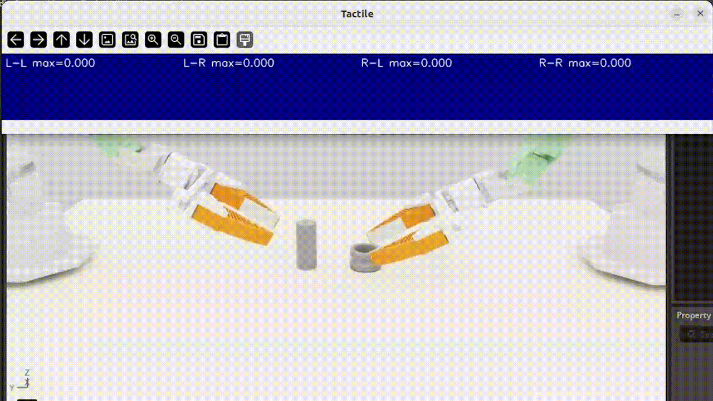

# IsaacSim Tactile Environment for FlexiTac

This repository contains tools for running FlexiTac in IsaacSim, including:

- **trajectory replay with tactile visualization**
- **a browser-based Viser interface for interactive control**



## 🛠️ Installation

### 1. Install Isaac Sim
Skip this step if Isaac Sim is already installed.

Follow the official NVIDIA documentation:  
[Isaac Sim Installation Guide](https://docs.isaacsim.nvidia.com/5.1.0/installation/quick-install.html)

Download Isaac Sim 5.1.0 or later:  
   [Isaac Sim 5.1.0 Linux Download](https://downloads.isaacsim.nvidia.com/isaac-sim-standalone-5.1.0-linux-x86_64.zip)

Extract the downloaded archive into an `isaac-sim` directory.
On Linux, run:

```bash
./post_install.sh
./isaac-sim.selector.sh
```

### 2. Clone this repository

```bash
git clone https://github.com/binghao-huang/FlexiTac-IsaacSim-Simulation.git
cd FlexiTac-IsaacSim-Simulation
```

### 3. Install IsaacLab and dependencies

Set up IsaacLab by following the official installation guide:  
[IsaacLab pip installation guide](https://isaac-sim.github.io/IsaacLab/main/source/setup/installation/pip_installation.html)

Create and activate a conda environment:

```bash
conda create -n tactile_isaaclab python=3.11
conda activate tactile_isaaclab
```

Install Isaac Sim pip packages:

```bash
pip install "isaacsim[all,extscache]==5.1.0" --extra-index-url https://pypi.nvidia.com
```

Install a CUDA-enabled PyTorch build that matches your system architecture:

```bash
pip install -U torch==2.7.0 torchvision==0.22.0 --index-url https://download.pytorch.org/whl/cu128
```

Verifying the Isaac Sim installation:

```bash
isaacsim
```

Run the install command that iterates over all the extensions in source directory and installs them using pip (with --editable flag):

```bash
cd ~/FlexiTac-IsaacSim-Simulation
./isaaclab.sh --install # or "./isaaclab.sh -i"
```


Install additional dependencies:

```bash
pip uninstall -y opencv-python-headless
pip install opencv-python==4.11.0.86
pip install viser
```

## 🖥️ Replay a Recorded Trajectory

Launch the tactile replay viewer with a saved dataset episode:

```bash
./isaaclab.sh -p Isaacsim_tactile_env/reply_with_tactile.py \
    --dataset_npz Isaacsim_tactile_env/data/dataset_train.npz \
    --normalization_pth Isaacsim_tactile_env/data/dataset_normalizer.npz \
    --episode_idx 3 \
    --replay_key joint_states \
    --steps_per_frame 3
```

## 🦾 Launch the Interactive Web Interface

Start the Viser-based teleoperation interface:

```bash
./isaaclab.sh -p Isaacsim_tactile_env/viser_interface.py \
    --headless \
    --enable_cameras
```

Then open the following in your browser:

```text
http://localhost:8080
```


# Acknowledgements

We thank Jimmy Wang, Yifan He, Xuihui Kang, and Yuhao Zhou for their contribution, valueable feedback and suggestions on this simulation environment.